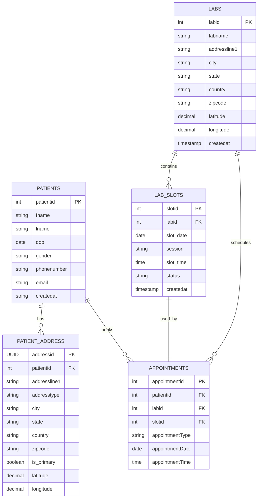

# 🏥 patient booking service deliverables

---

## ✅ 1. ERD Diagram

---

## ✅ 3. C2 Architecture (Container View)

graph TD
    User((User))

    subgraph Aggregator Layer
        AggregatorService[Aggregator Service Orchestrates Booking Workflow]
    end

    subgraph Microservices
        PatientService[Patient Service Handles patient data & addresses]
        LabService[Lab Service Handles labs & slots]
        AppointmentService[Appointment Service Books appointments]
        DistanceService[Distance Service Calculates nearest labs]
    end

    subgraph External APIs
        Nominatim[Nominatim API Geolocation API]
    end

    subgraph Databases
        PatientDB[(PostgreSQL - Patient DB)]
        LabDB[(PostgreSQL - Lab DB)]
        AppointmentDB[(PostgreSQL - Appointment DB)]
    end

    User --> AggregatorService

    AggregatorService --> PatientService
    AggregatorService --> LabService
    AggregatorService --> AppointmentService
    AggregatorService --> DistanceService

    PatientService --> PatientDB
    LabService --> LabDB
    AppointmentService --> AppointmentDB
    DistanceService --> Nominatim

